# Инструкция пользователя

«Менеджер приветствия» (EISWM) меняет звуки и картинки, которыми Evolute I-Space первого
(дорестайлингового) поколения встречает водителя при включении автомобиля, и показывает сводку:
при старте — температуру, запас хода, заряд, топливо и предупреждения, в конце поездки — её итоги. Приложение проверено
на машине 2024 года выпуска липецкой сборки; о возможно совместимых моделях написано в
[README](../README.md).

Скриншоты сделаны на эмуляторе с экраном машины 1920×720 в русском интерфейсе, светлая тема.
На машине всё выглядит так же, кроме двух мест. В строке версии на машине нет приписки
`-emulator`. А в эмуляторе нет данных машины, поэтому в разделе «Сводка» показан пример значений
с подсказкой «Нет связи с машиной — показан пример»; на машине там настоящие значения.

Как собрать и установить приложение, написано в [docs/ANALYSIS.md](ANALYSIS.md#7-сборка).

## Содержание

1. [Первый запуск](#1-первый-запуск)
2. [Стартовый экран](#2-стартовый-экран)
3. [Звуки](#3-звуки)
4. [Добавление звуков](#4-добавление-звуков)
5. [Картинки](#5-картинки)
6. [Добавление своих картинок](#6-добавление-своих-картинок)
7. [Стандартные картинки и времена года](#7-стандартные-картинки-и-времена-года)
8. [Выключение картинок](#8-выключение-картинок)
9. [Сводка](#9-сводка)
10. [Помощь, тема и выход](#10-помощь-тема-и-выход)
11. [Вопросы и ответы](#11-вопросы-и-ответы)

## 1. Первый запуск

Значок приложения в лаунчере подписан **«Приветствие»**. При первом запуске появляется окно
«Отказ от ответственности»: приложение неофициальное и используется на свой риск.
Окно закрывается только кнопкой **«Понятно»** и больше не показывается. Полный текст — в
[DISCLAIMER.md](../DISCLAIMER.md).

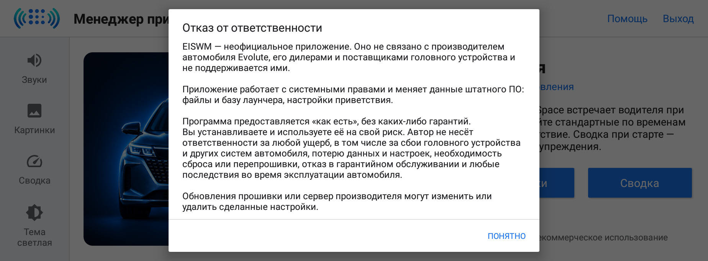

Если в машине не было ни одной картинки приветствия, приложение при первом запуске ставит
стандартную летнюю картинку, чтобы экран приветствия не был пустым.

## 2. Стартовый экран

Приложение всегда открывается со стартового экрана: картинка машины, название, версия и строка
обновлений, кнопки **«Звуки»**, **«Картинки»** и **«Сводка»**, контакты разработчика и лицензия.
Окно отказа от ответственности можно открыть снова: **«Помощь»** на стартовом экране, кнопка
**«Отказ от ответственности»**.

Если приложение открыто не во весь экран (например, рядом осталась панель лаунчера), картинка
машины уменьшается, а текст и боковые панели разделов можно прокрутить.

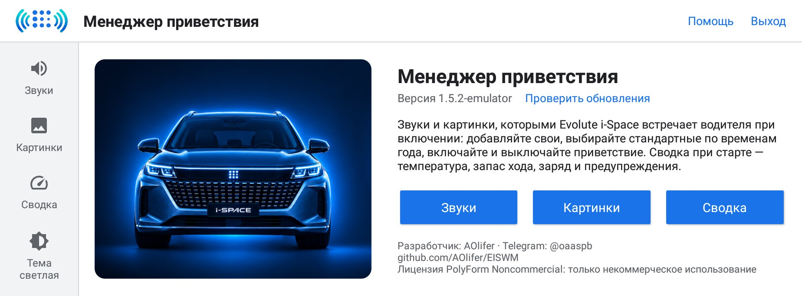

Слева колонка разделов: **Звуки**, **Картинки**, **Сводка**, а внизу кнопка **Тема**. Нажатие на
логотип или название «Менеджер приветствия» вверху возвращает на стартовый экран из любого раздела.

### Обновления

Рядом с версией стоит **«Проверить обновления»**. Приложение и само проверяет обновления при
запуске, не чаще раза в сутки. Для этого машине нужен интернет; если связи нет, ничего не
происходит. Когда на сервере есть новая версия, вместо «Проверить обновления» появляется
**«Доступна версия N. Подробнее…»**.

Нажатие открывает окно с описанием изменений и кнопкой **«Скачать и установить»**. Пока идёт
загрузка, видна полоска прогресса, загрузку можно отменить. Скачанный файл приложение проверяет
и, если он повреждён или не подходит, не ставит его и сообщает причину. После установки
приложение закрывается и открывается снова уже новой версии. Звуки, картинки и настройки при
обновлении сохраняются.

## 3. Звуки

Звук приветствия — MP3-файл, который машина проигрывает при включении автомобиля. Если звуков
несколько, машина каждый раз выбирает один случайно.

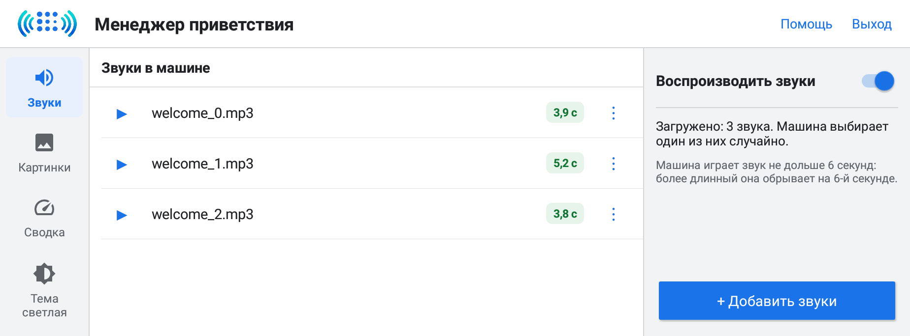

- В центре список **«Звуки в машине»**. У каждого звука метка длительности: зелёная — звук
  короче 6 секунд, жёлтая «оборвётся на 6 с» — звук длиннее, машина обрежет его на 6-й секунде.
- **▶** проигрывает звук, повторное нажатие останавливает. Во время проигрывания под названием
  бежит полоска прогресса.

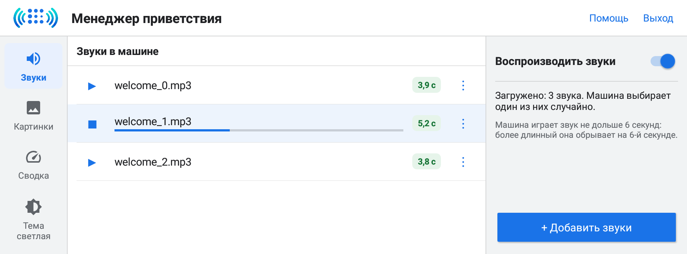

- **⋮** открывает меню звука: **«Сохранить копию в…»** (в память устройства или на USB-флешку) и
  **«Удалить»**. Перед удалением приложение переспрашивает.

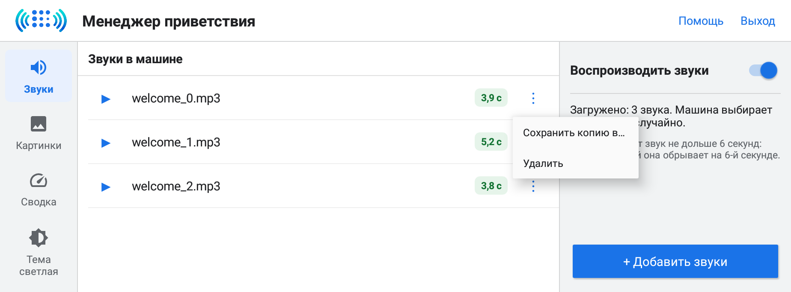

- Справа переключатель **«Воспроизводить звуки»**. Если его выключить, подпись меняется на
  «Не воспроизводить звуки» и появляется предупреждение: машина не будет проигрывать звук при
  включении. Сами файлы остаются на месте, включить звук можно в любой момент.

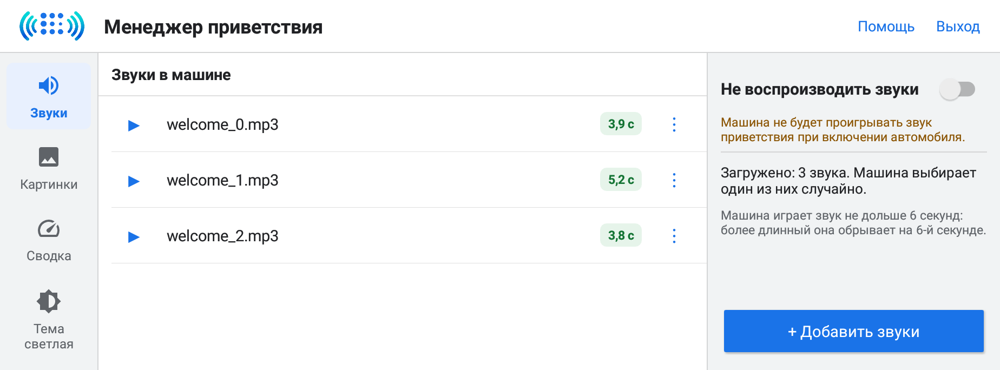

Надпись справа начинается со слова «Загружено» и показывает, сколько звуков стоит в машине.

## 4. Добавление звуков

Кнопка **«+ Добавить звуки»** открывает экран выбора файлов в три колонки:

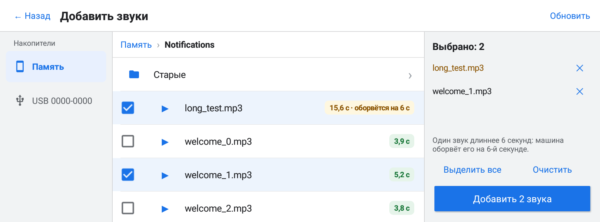

1. **Накопители** слева: «Память» (внутренняя память устройства) и подключённые USB-флешки.
2. **Папка** в центре. Путь вверху нажимается по частям, чтобы вернуться на уровень выше.
   Показываются папки и MP3-файлы с длительностью, **▶** даёт прослушать файл до добавления.
3. **Выбранное** справа: отмеченные файлы с кнопкой ✕ для отмены. Выбор сохраняется, даже если
   перейти в другую папку. **«Выделить все»** отмечает все MP3 в текущей папке, **«Очистить»**
   снимает все отметки. Кнопка внизу показывает, сколько звуков будет добавлено.

**«Обновить»** вверху перечитывает накопители, например после того как вставили флешку.

Если среди выбранных есть звук длиннее 6 секунд, приложение предупреждает, что машина оборвёт
его на 6-й секунде. Можно **«Всё равно добавить»**, добавить остальные **«Без него»**
или вернуться к выбору кнопкой **«Отмена»**.

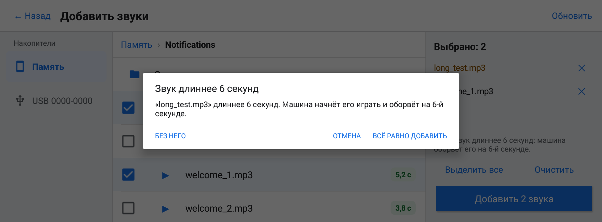

Если звук с таким именем уже есть в машине, можно **«Заменить»** его, **«Пропустить их»**
(добавить только новые) или **«Отмена»**.

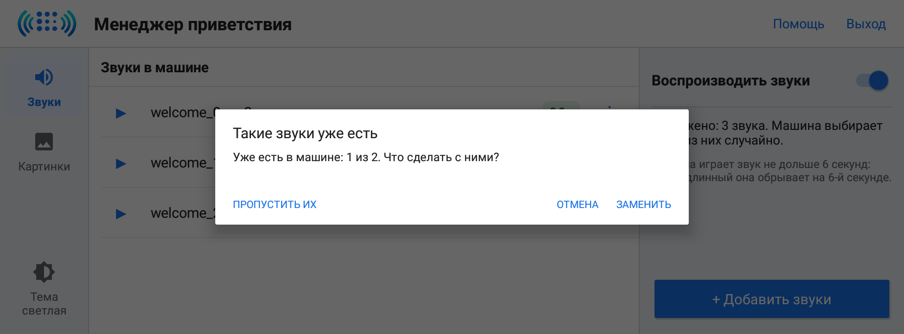

После копирования приложение возвращается в раздел «Звуки» и сообщает, сколько файлов добавлено
и сколько пропущено.

## 5. Картинки

Картинка приветствия показывается на экране при включении автомобиля. Если картинок несколько,
машина каждый раз выбирает одну случайно.

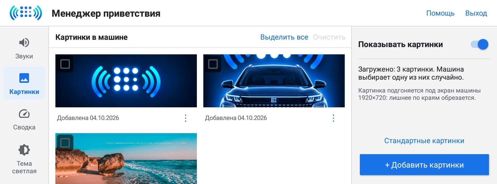

- В центре **«Картинки в машине»** — превью в две колонки. Под превью подпись: когда картинка
  добавлена, «Стандартная» или «Стандартная, по сезону» с меткой сезона. Если срок показа
  картинки уже прошёл, это тоже отмечено.
- Нажатие на превью открывает картинку крупно.

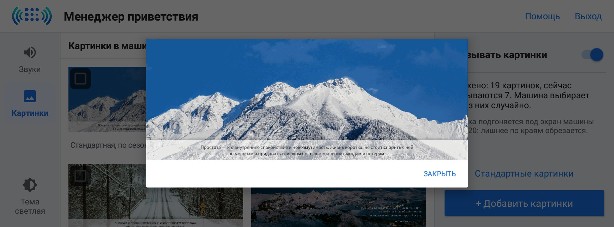

- **⋮** под превью: **«Сохранить копию в…»** и **«Удалить»**.

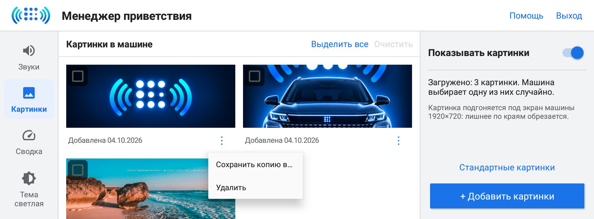

«Сохранить копию в…» открывает выбор папки. Перейдите в нужную папку памяти или флешки и нажмите
**«Сохранить сюда»**.

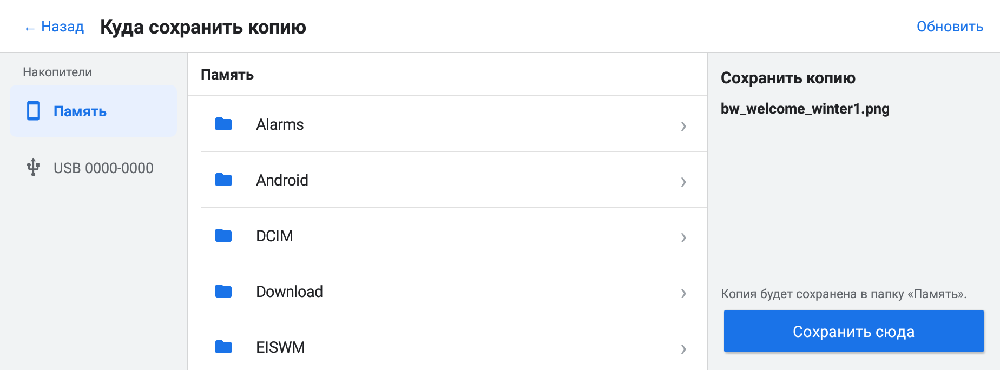

- Квадратик в углу превью выделяет картинку. Когда что-то выделено, в заголовке появляется
  «Выделено: N из M» и красная кнопка **«Удалить (N)»**. **«Выделить все»** и **«Очистить»**
  выделяют все картинки и снимают выделение.

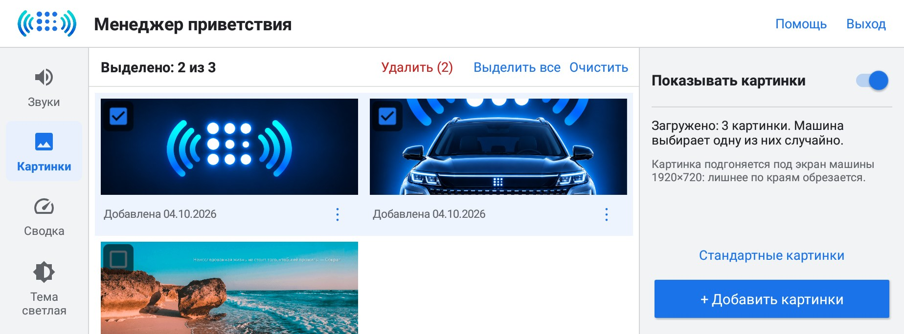

Надпись справа показывает, сколько картинок загружено и сколько из них машина показывает сейчас:
картинки по временам года показываются только в свой сезон.

## 6. Добавление своих картинок

Кнопка **«+ Добавить картинки»** открывает тот же экран выбора файлов, что и для звуков, но с
превью картинок. Подходят PNG, JPG, WEBP и BMP.

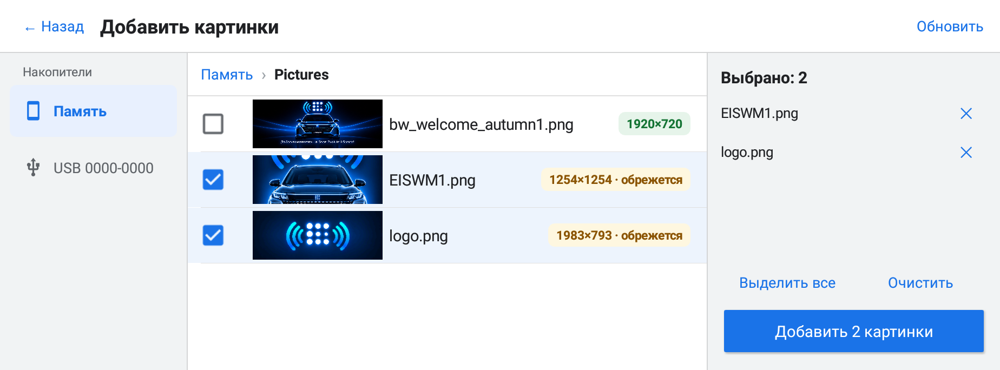

Рядом с каждым файлом написан его размер. Зелёная метка «1920×720» — картинка точно под экран
машины. Жёлтая «обрежется» — пропорции другие: приложение уменьшит картинку под 1920×720 и
обрежет лишнее по краям, оставив центр. Лучше заранее готовить картинки размером 1920×720.

Добавленные картинки приложение сохраняет в PNG и держит у себя их копии (см.
[вопросы и ответы](#11-вопросы-и-ответы)).

## 7. Стандартные картинки и времена года

Кнопка **«Стандартные картинки»** в разделе «Картинки» открывает 16 штатных картинок лаунчера с
русским текстом, по четыре на каждое время года.

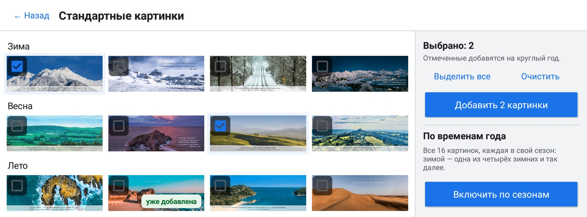

Есть два способа их использовать:

- **На круглый год.** Отметьте нужные картинки (или **«Выделить все»**) и нажмите
  **«Добавить N картинки»**. Они будут показываться весь год вместе с остальными. Уже добавленные
  помечены «уже добавлена».
- **По временам года.** Кнопка **«Включить по сезонам»** добавляет все 16 картинок, каждую со
  сроком показа в свой сезон: зимой (декабрь — февраль) машина показывает одну из четырёх зимних,
  весной — одну из весенних и так далее. Сроки на следующий год приложение обновляет само при
  запуске и при старте машины. Выключается той же кнопкой — «Выключить по сезонам».

В разделе «Картинки» сезонные картинки подписаны «Стандартная, по сезону» с меткой сезона.

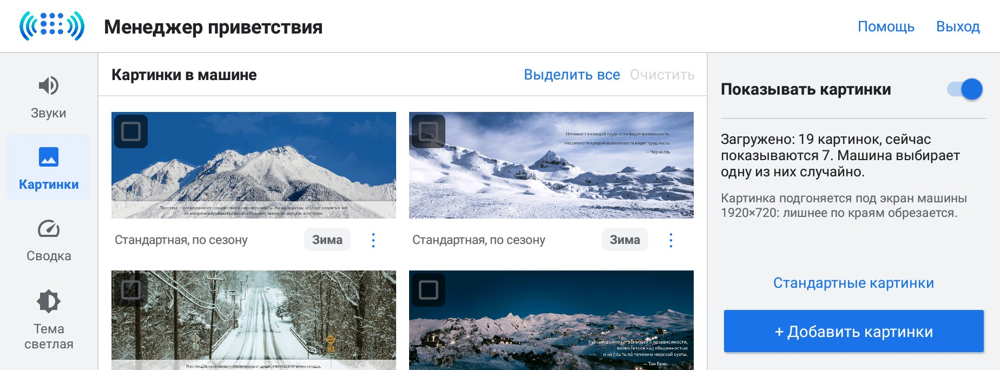

Свои картинки и сезонные показываются вместе: в каждый момент машина выбирает случайно из своих
картинок и четырёх картинок текущего сезона. Если нужны только сезонные, удалите остальные.

## 8. Выключение картинок

Переключатель **«Показывать картинки»** справа выключает картинки приветствия. Подпись меняется на
«Не показывать картинки», превью бледнеют, появляется предупреждение: при приветствии экран будет
тёмным.

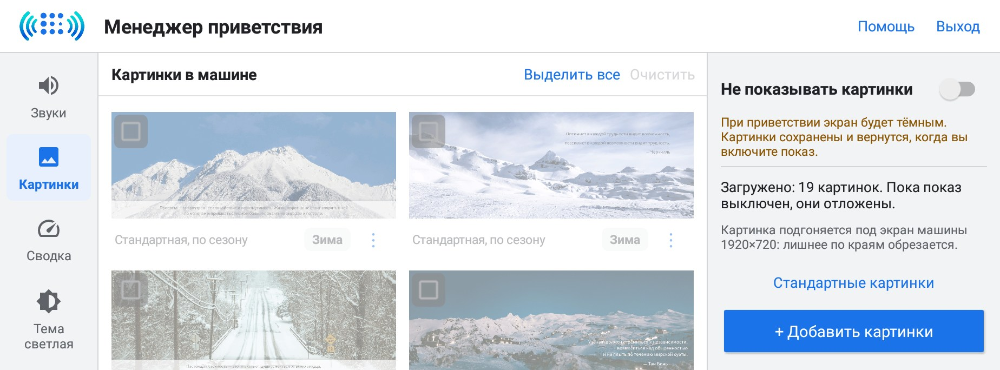

Картинки при этом не удаляются: приложение откладывает их и возвращает, когда переключатель снова
включают.

## 9. Сводка

Сводка — плашка внизу экрана с самыми нужными данными машины. В разделе две вкладки: **«Старт»**
(при включении зажигания) и **«Итоги»** (в конце поездки). У каждой вкладки свои пункты, их
порядок и время показа. Значения берутся из машины; расстояния — в километрах или милях,
температура — в °C или °F, как выбрано в настройках машины.

### Старт

После включения зажигания, когда закроется экран приветствия, внизу экрана появляется плашка:
предупреждения, температура за бортом, запас хода (общий и на электричестве), заряд батареи,
топливо в баке, пробег до ТО. Сводка появляется и после долгой стоянки, когда магнитола
загружается заново. Нажатие на плашку закрывает её раньше.

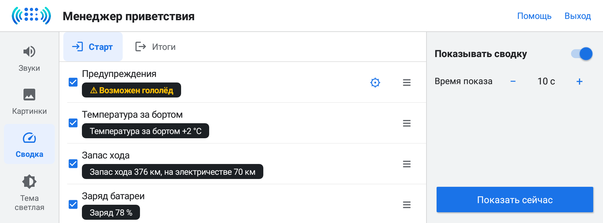

- **«Показывать сводку»** справа включает и выключает сводку при старте.
- **Галочка** у пункта включает и выключает его. Под названием пункта — как он будет выглядеть
  на плашке с текущими значениями машины.
- **≡** справа у пункта: потяните вверх или вниз, чтобы поменять порядок (или долго нажмите на
  пункт).
- **«−» и «+» у «Время показа»** — сколько секунд видна плашка: от 5 до 60, по умолчанию 10.
- **«Показать сейчас»** показывает сводку прямо сейчас.

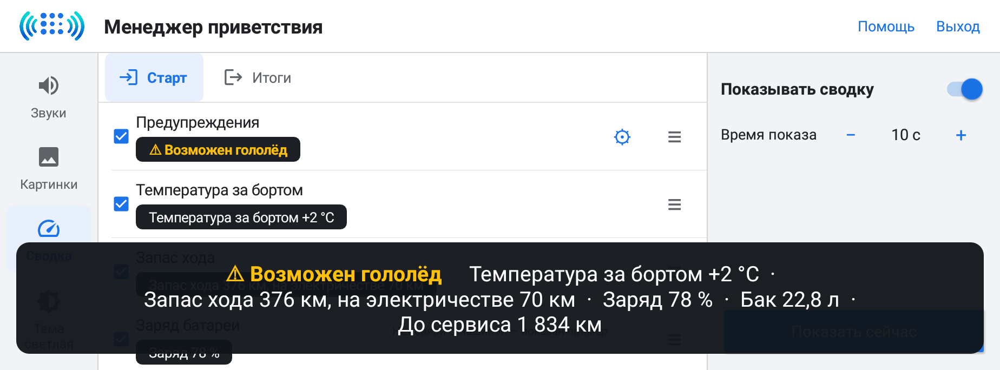

На плашке пункты разделены точками и не разрываются при переносе строки.

**Предупреждения** выделены жёлтым. Кнопка **⚙** у пункта «Предупреждения» открывает их
настройку: галочка включает предупреждение, «−» и «+» меняют порог. Есть предупреждения
«Возможен гололёд», «Мало запаса хода», «Мало заряда», «Мало топлива», «Скоро ТО» и «Низкое
напряжение АКБ».

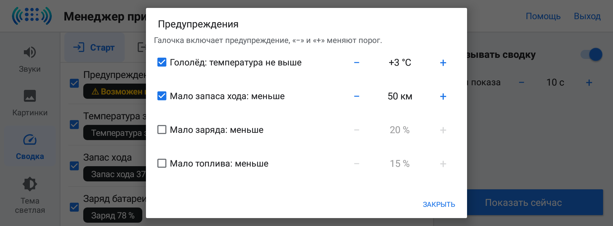

**Топливо.** Пункт «Топливо в баке» показывает остаток, «Свободно в баке» — сколько ещё войдёт
(по умолчанию выключен). Кнопка **«л» / «%»** у каждого пункта о топливе переключает литры и
проценты, у каждого пункта отдельно. Литры считаются от объёма бака 60 л: машина отдаёт остаток
в процентах, поэтому точность — около литра.

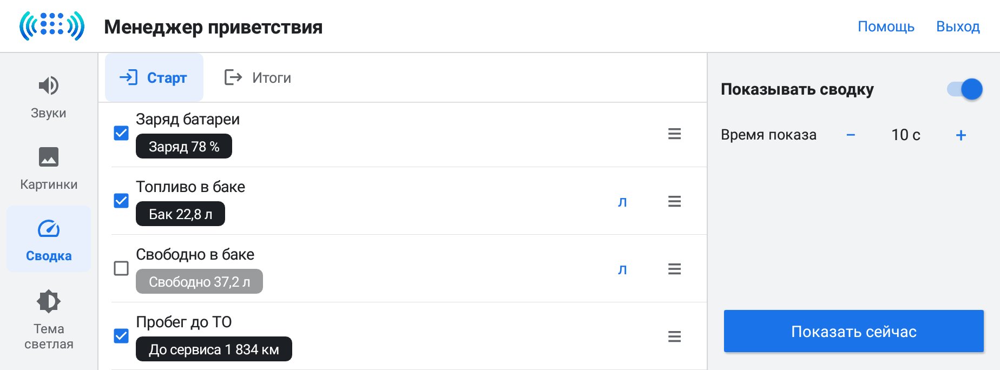

### Итоги

В конце поездки, когда машина остановилась и селектор переведён в **P**, появляется плашка с
итогами: пробег за поездку, время в пути, средняя скорость, расход заряда и топлива, остаток
запаса хода. Поездка считается от включения зажигания. Если после этого снова поехать, поездка
продолжается, и на следующей остановке итоги будут с самого включения. После совсем короткой
поездки (меньше 0,5 км или 2 минут) итоги не показываются. При выключении зажигания итоги не
показываются: магнитола гаснет сразу.

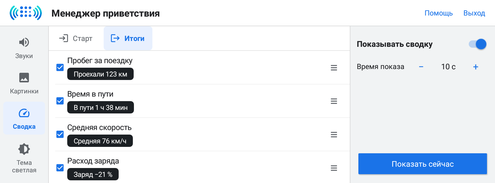

Пункты, выключатель, время показа и «Показать сейчас» работают так же, как на вкладке «Старт».
«Показать сейчас» показывает итоги последней поездки.

## 10. Помощь, тема и выход

- **«Помощь»** вверху справа — краткая справка по текущему разделу (своя на стартовом экране,
  в «Звуках», в «Картинках» и на каждой вкладке «Сводки»).

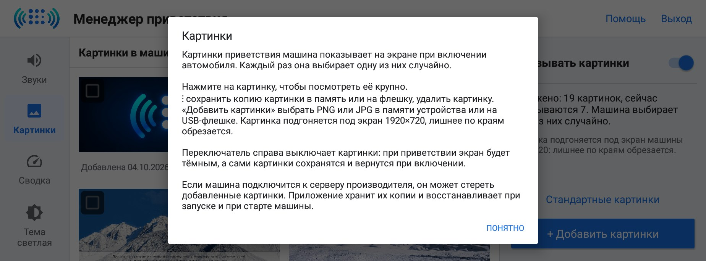

- **«Тема»** внизу колонки разделов переключает оформление по кругу: авто (по ночному режиму
  системы), светлая, тёмная.

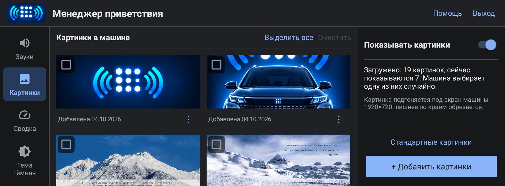

- **«Выход»** закрывает приложение и убирает его из недавних. Системная кнопка «Назад» на главном
  экране делает то же самое. Если в этот момент идёт копирование, приложение спросит:
  «Дождаться» или «Выйти сейчас».

## 11. Вопросы и ответы

**Добавленные картинки пропали.** Если машина подключится к серверу производителя, служба
загрузки лаунчера может стереть картинки, которых нет на сервере. Приложение хранит копии
добавленных картинок и возвращает их при своём запуске и при каждом старте машины. Достаточно
перезапустить машину или открыть приложение.

**Звук обрывается.** Машина играет звук приветствия не дольше 6 секунд. Такие звуки отмечены
жёлтой меткой «оборвётся на 6 с»; укоротите файл до 6 секунд, чтобы он звучал целиком.

**Картинка обрезана.** Экран машины 1920×720 (8:3). Картинку других пропорций приложение
обрезает по краям, оставляя центр. Подготовьте картинку 1920×720, чтобы видеть её целиком.

**Сводка не появилась.** Проверьте, что на нужной вкладке включено «Показывать сводку» и
отмечены пункты. Пункт без значения от машины на плашку не попадает: в настройках у него написано
«Машина не отдаёт значение». Итоги не показываются после совсем короткой поездки.

**Литры топлива немного расходятся с ELM или приборкой.** Машина отдаёт остаток топлива целыми
процентами, а литры приложение считает от бака 60 л. Один процент — это 0,6 л.

**Язык интерфейса.** Приложение говорит на языке системы: русский, немецкий, китайский, для остальных
языков — английский.
